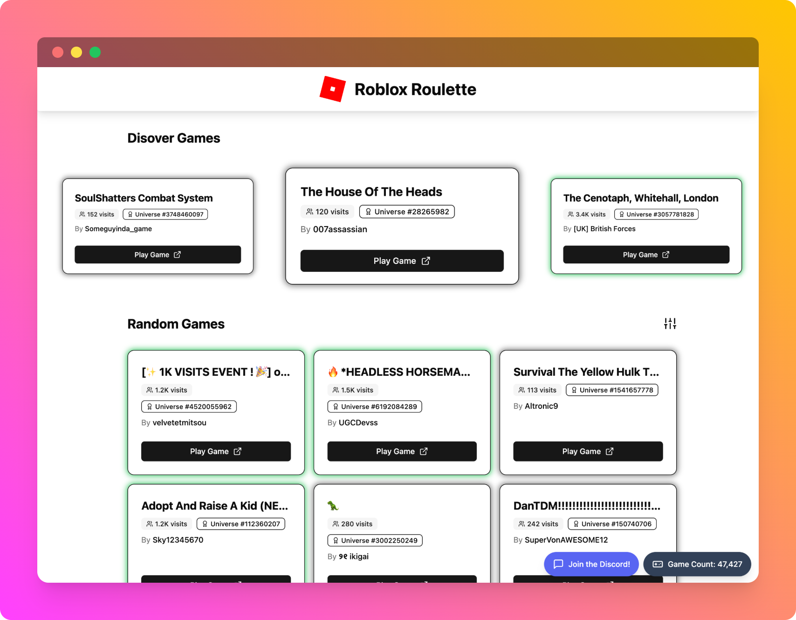

# Roblox Roulette



## About This Project

Me and my brother have played Roblox together since we were very little. Of course, I don't play it on my own anymore. But it is still a way that we bond together. However, modern roblox is very commercial, and it can
be hard to find a game that feels like it was made purely for fun. This is when we had the idea to make a roblox game that sends you to another random roblox game. And not just popular ones: a random game selected out of the billions
of games that exist.

Due to roblox security rules, that idea was bust. But it didn't stop me from wanting to collect the data anyway. Roblox stores games with incremental ids, but there is no way to fetch games playability status / play count / date / etc in bulk. This left one option: performing queries
at random game ids within the known range of valid ids, and slowly building up a dataset.
This is exactly what I did. At first it was just a single python script. But because of rate limitng, I was only able to check 50 games per second (1 request per second, 50 games per request). This was outrageously slow for two reasons:

1. I had a quality-condition: no games with less than 100 plays. Any less than that and it was likely junk.
2. No games that were private / unlisted. They had to be publicly playable.

After a bit of trial and error, I came to a solution to get around roblox rate limiting. I split the program into two parts: the part that queries roblox's servers, and the part that aggregates the data. I ran a local flask server and exposed the latter program to the internet.
Then I span up 5 AWS t2.nano instances. More than 5 and the resource began slowing down globally. Each one got their own public ip, and so were each subjected to their own limit. This increased my query rate up to 300 games per second (I ran a scraper locally as well). After a week, I had a database of 40,000 unique games all with 100 plays or above.

The last step was to build a fun website to display the data. Me and my brother had many ours of fun searching through these lost worlds. Many of these games were exactly what we were looking for: something made for fun only.
Many of these games had millions of plays, but were now lost to time. Some of these games only had a few hundred, and hadn't been touched in over a decade. This project brought them back to life, so they could bring joy once again.

Below is an AI-generated README that covers all the features. Thanks for reading!

---

A web application that helps users discover random Roblox games through an interactive roulette interface and game discovery system.

## 🎮 Features

- **Interactive Game Roulette**: A rotating carousel that showcases random Roblox games
- **Game Discovery**: Browse through a curated collection of Roblox games with filtering options
- **Visit Count Filtering**: Filter games by minimum play count (100+ to 100M+)
- **Infinite Scrolling**: Seamless loading of new games as you scroll
- **Responsive Design**: Works across desktop and mobile devices
- **Real-time Data**: Continuously updated game database through automated crawling

## 🏗️ Architecture

The project consists of three main components:

### 1. Game Crawler (`go/`)

- **Language**: Go
- **Purpose**: Discovers new Roblox games by querying the Roblox API
- **Features**:
  - Generates random game IDs and queries the Roblox Games API
  - Filters games by minimum visit count (100+ visits)
  - Submits valid games to the data server
  - Rate limiting and error handling

### 2. Data Server (`server/`)

- **Language**: Python (Flask)
- **Purpose**: Collects and validates game data from the crawler
- **Features**:
  - Receives game submissions from the crawler
  - Validates game playability using Roblox API
  - Stores verified games in CSV format
  - Prevents duplicate entries
  - Background processing for game validation

### 3. Web Application (`selector/`)

- **Language**: TypeScript/React
- **Framework**: Vite + React 19
- **UI Library**: Radix UI + Tailwind CSS
- **Purpose**: Provides the user interface for game discovery
- **Features**:
  - Interactive game roulette with smooth animations
  - Infinite scroll game grid
  - Real-time filtering controls
  - Responsive design with mobile support

## 🚀 Getting Started

### Prerequisites

- Node.js (for the web application)
- Python 3.x (for the data server)
- Go (for the crawler)

### Installation

1. **Clone the repository**

   ```bash
   git clone https://github.com/Git-Monke/RobloxRoulette.git
   cd RobloxRoulette
   ```

2. **Set up the web application**

   ```bash
   cd selector
   npm install
   npm run dev
   ```

3. **Set up the data server**

   ```bash
   cd server
   pip install flask pydantic requests
   export ROBLOSECURITY="your_roblox_security_token"
   python server.py
   ```

4. **Build and run the crawler**
   ```bash
   cd go
   go build -o crawler main.go
   ./crawler
   ```

## 🛠️ Development

### Web Application

- **Development**: `npm run dev`
- **Build**: `npm run build`
- **Deploy**: `npm run deploy` (deploys to GitHub Pages)

### Data Server

- Runs on port 1948
- Logs activity to `server.log`
- Stores game data in `games.csv`

### Crawler

- Continuously runs and discovers new games
- Configurable minimum visit threshold
- Built-in rate limiting and error handling

## 📊 Data Flow

1. **Game Discovery**: Go crawler generates random game IDs and queries Roblox API
2. **Data Collection**: Valid games are submitted to the Python Flask server
3. **Validation**: Server validates game playability and stores in CSV
4. **Web Display**: React application loads game data and displays in interactive UI

## 🔧 Configuration

### Environment Variables

- `ROBLOSECURITY`: Required for the data server to validate game playability

### Customization

- Modify `minVisits` in `go/main.go` to change minimum visit requirements
- Adjust `NEW_GAMES_PER_SCROLL` in `selector/src/App.tsx` for pagination size
- Update filtering options in the React components

## 📱 Deployment

The web application is configured for deployment to GitHub Pages. The data server and crawler can be deployed to any server with appropriate environment variables.
